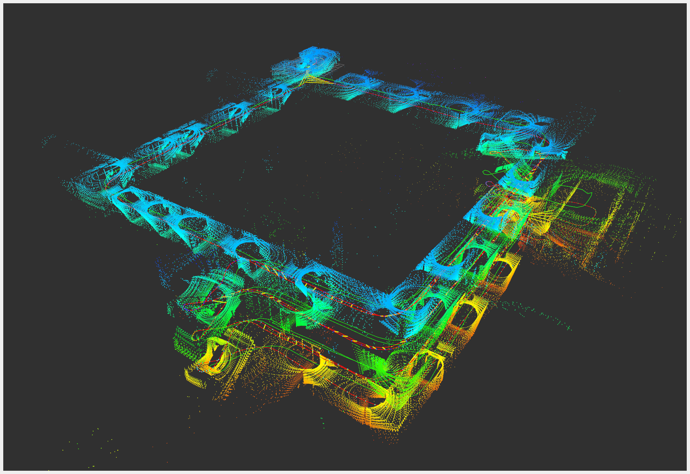
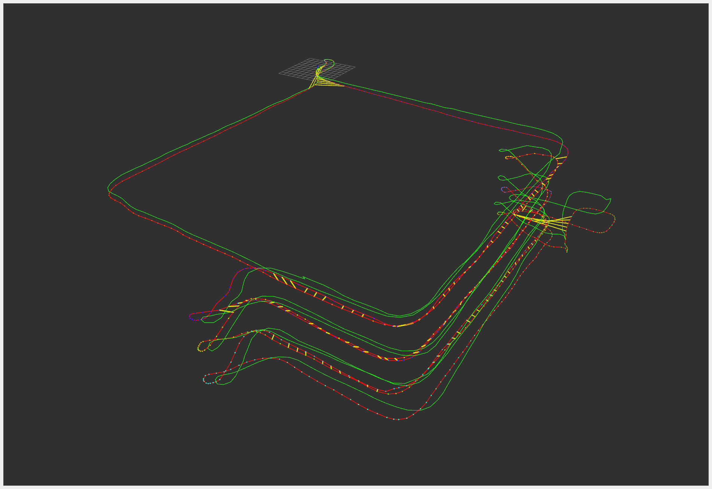
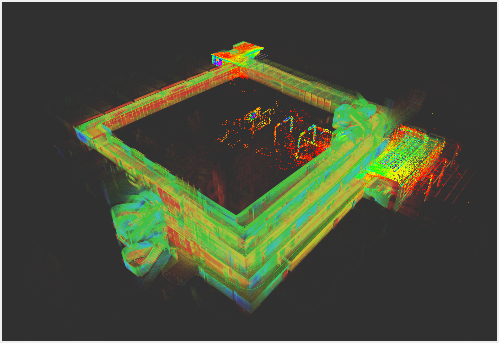
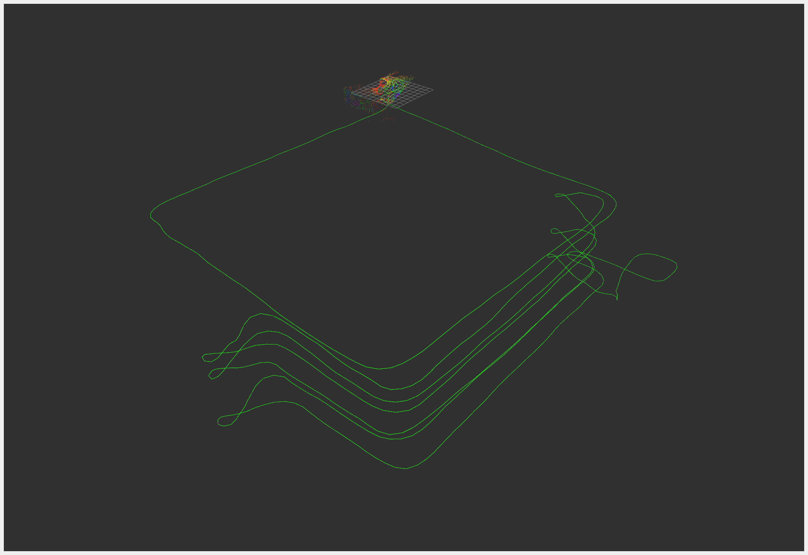
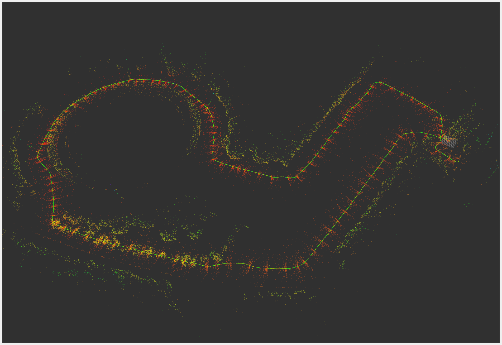
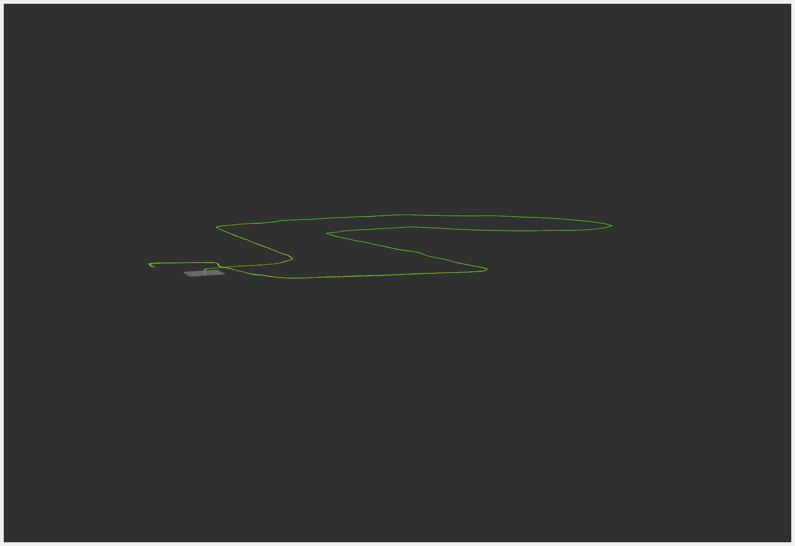
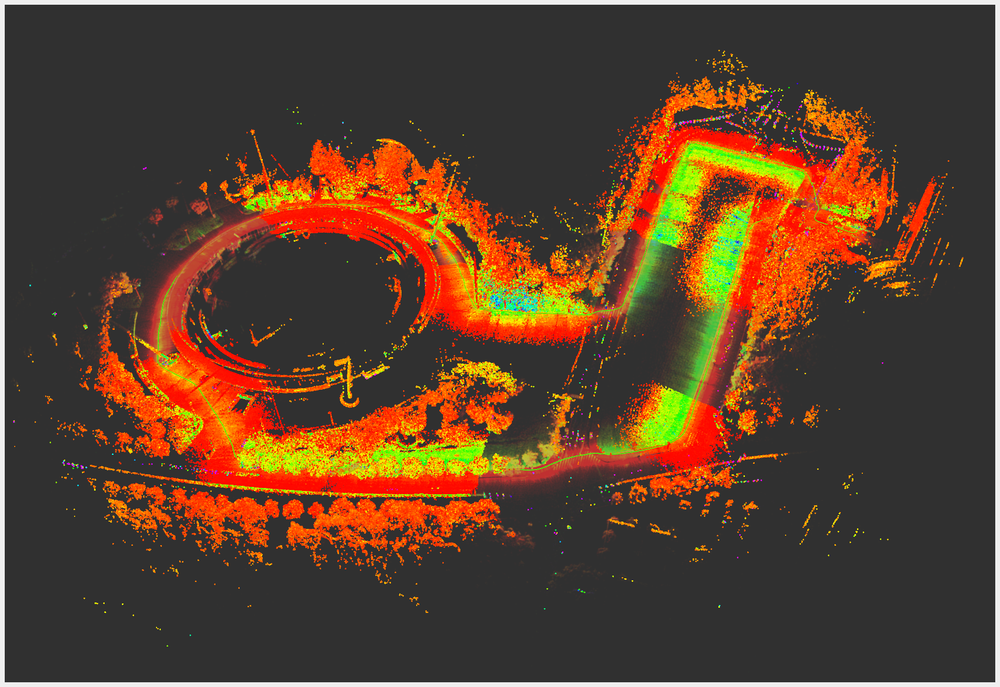
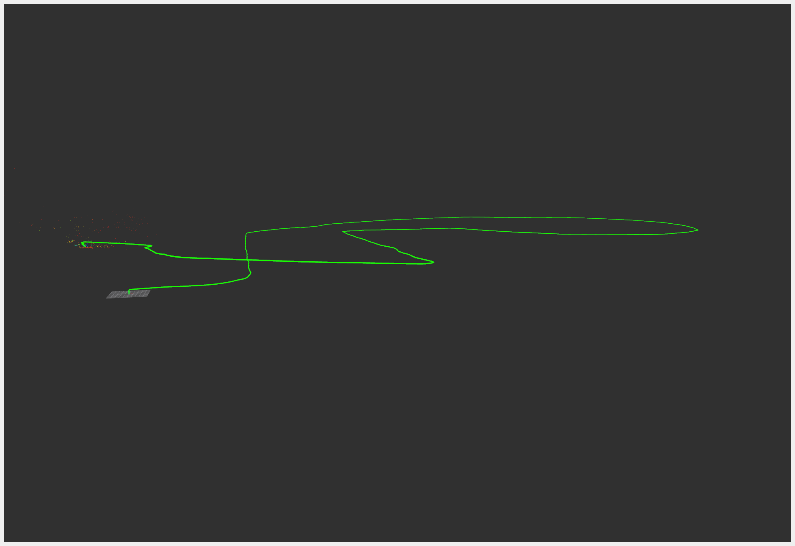

# FAST-LIO-SAM

A LiDAR-inertial SLAM system that integrates **FAST-LIO2** as the high-frequency frontend with a **LIO-SAM-style factor graph backend** for global optimization, enhanced by **hierarchical scene representation** and **ground-normal constraints**, and compatible with both **ROS1** and **ROS2**.

<p align="center">
  
  
  
  
</p>

<p align="center">
<em>
Comparison of multi-floor mapping results: 
<strong>our method</strong> enhanced with 
<strong>hierarchical scene representation</strong>, 
<strong>ground-normal constraints</strong>, and 
<strong>loop closure</strong> (top) versus 
<strong>FAST-LIO2</strong> (bottom).
</em>
</p>

<p align="center">
  
  
  
  
</p>

<p align="center">
<em>
Comparison of outdoor mapping results: 
<strong>our method</strong> enhanced with
<strong>ground-normal constraints</strong>, and 
<strong>loop closure</strong> (top) versus 
<strong>FAST-LIO2</strong> (bottom).
</em>
</p>

## 🧩 Contributions

* A SLAM system that integrates FAST-LIO2 with a LIO-SAM-style factor graph backend.

* ROS1 and ROS2 adaptation

* Hierarchical scene representation

* Support ground-normal constraints in pose graph

* Manual initial pose setting for relocalization

* Support GNSS factors in the pose graph

* Stationary detection and adaptive weight handling between LiDAR update scans and ZUPT

* Support for RoboSense LiDARs, Unilidar LiDARs
  
* The standard navigation TF tree: **map** → **odom** → **base_link**

* Support localization mode: Online, Prior and Online+Prior localization

## 🛠️ Prerequisites

### Dependency

* [gtsam](https://gtsam.org/get_started/) (Georgia Tech Smoothing and Mapping library)

```bash
# Ubuntu 20.04
sudo add-apt-repository ppa:borglab/gtsam-release-4.0
# Ubuntu 22.04
sudo add-apt-repository ppa:borglab/gtsam-release-4.1

sudo apt install libgtsam-dev libgtsam-unstable-dev
```

### ROS1 Build

```bash
mkdir fastlio_sam_ws
cd fastlio_sam_ws

mkdir src && cd src
git clone https://github.com/RightTr/FAST-LIO-SAM.git

cd src/FAST-LIO-SAM
git submodule update --init --recursive

# ROS1 build
./build.sh ROS1

# ROS2 build
./build.sh humble
```

## 🚀 Usage

### LIO-SAM-style Backend

```bash
cd fastlio_ws 
source devel/setup.bash
# e.g.
roslaunch fast_lio_sam mapping_airy.launch
```

### Ground normal constraint

`groundEnableFlag` enables ground-normal pose-graph constraints from plane observations.

### Hierarchical representation

`sceneEnableFlag` enables floor-range hierarchy for floor-aware loop closure and ground constraints; when off, loop falls back to ordinary spatial search.

### TF layout

The system uses one global correction link and two local odometry outputs:

- `map -> odom`: backend / relocalization correction
- `odom -> base_link`: LiDAR-updated odometry
- `odom -> base_link_hf`: IMU high-frequency odometry

### Relocalization

The modified system supports relocalization using manually set odometry poses. Once odometry poses are published to the */reloc_topic* (according to the following .yaml file), the system will apply a pose correction and update the current state consistently.

### Localization mode

`common/mode`:
- `1`: online: Use only the online map for constraints.
- `2`: prior: Use only the prior map for constraints.
- `3`: online+prior: Use both the online map and the prior map for constraints.

`prior_map/prior_init` enables one-shot startup alignment in `prior` mode.
It uses the prior map to refine the initial pose before tracking starts.

You can generate a prior `ikdtree` snapshot from a PCD file with `pcd_to_ikdtree_bin`.

### Keyframe export

Enable `lio_sam/keyframe_export_en` to export each accepted keyframe as a full-resolution PCD built from `feats_undistort`, together with its pose, under `ROOT_DIR/RESULTS/KEY_FRAMES/scans/` and `ROOT_DIR/RESULTS/KEY_FRAMES/pose.txt`.

Enable `lio_sam/keyframe_global_pcd_en` to additionally stitch all exported keyframes into one global PCD at `ROOT_DIR/RESULTS/KEY_FRAMES/global.pcd`.

### Result save

* `result_save/feat_accum_save_en` to accumulate each undistorted scan in the world frame. The merged feature cloud is maintained in memory during runtime and written to `ROOT_DIR/RESULTS/PCD/<lidar_time>.pcd` when the system shuts down. 
* `result_save/imu_state_save_en` saves each IMU state to `ROOT_DIR/RESULTS/IMU_STATES/imu_state.txt`. 
* `result_save/scan_frame_save_en` saves each undistorted scan in LiDAR body frame under `ROOT_DIR/RESULTS/SCAN_FRAMES/scans/<lidar_time>.pcd`, saves the corresponding timestamped cloud under `ROOT_DIR/RESULTS/SCAN_FRAMES/scans_tstamp/<lidar_time>.pcd`, and writes the pose to `ROOT_DIR/RESULTS/SCAN_FRAMES/scan_pose.txt`.

## Stationary detection and adaptive weight handling

The system will adjust the confidence of the ZUPT and LiDAR updates based on the detected motion state, using **accelerometer and gyroscope variances** as well as **the EMA of velocity**. When the system detects a stationary state, it will increase the confidence of the ZUPT update and decrease the confidence of the LiDAR update, and vice versa when in motion.

Check the related parameters in the .yaml files.

### Extended LiDAR support

Now, FAST-LIO supports tracking and mapping using the RoboSense LiDARs (e.g., RoboSense Airy) and Unilidar LiDARs (e.g., Unilidar L2). Check the related files in ./config, ./launch_ROS1/odom, ./launch_ROS1/mapping, ./launch_ROS2/odom, and ./launch_ROS2/mapping.

```bash
# e.g.
roslaunch fast_lio_sam odom_airy.launch
```

## 📝 TODO List

* [x] GNSS fusion test
* [ ] Full situational_graphs adaptation
* [ ] ZUPT parameter tuning and test
* [ ] Prior localization test

## 📚 Related Works
[FAST-LIO: A Fast, Robust LiDAR-inertial Odometry Package by Tightly-Coupled Iterated Kalman Filter](https://arxiv.org/abs/2010.08196)

[FAST-LIO official repository](https://github.com/hku-mars/FAST_LIO.git)

[FAST_LIO_SAM](https://github.com/kahowang/FAST_LIO_SAM.git)

[LIO-SAM](https://github.com/TixiaoShan/LIO-SAM.git)

[robosense_fast_lio](https://github.com/RuanJY/robosense_fast_lio.git)

[point_lio_unilidar](https://github.com/unitreerobotics/point_lio_unilidar.git)

[BALM](https://github.com/hku-mars/BALM.git)

[lidar_situational_graphs](https://github.com/snt-arg/lidar_situational_graphs.git)
